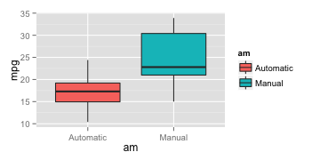
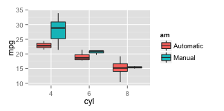
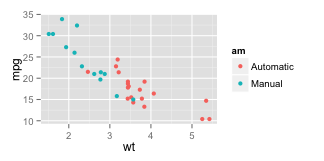
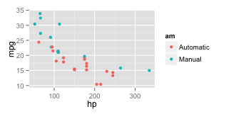
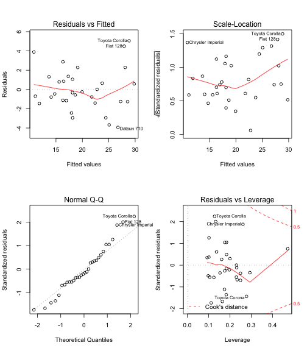
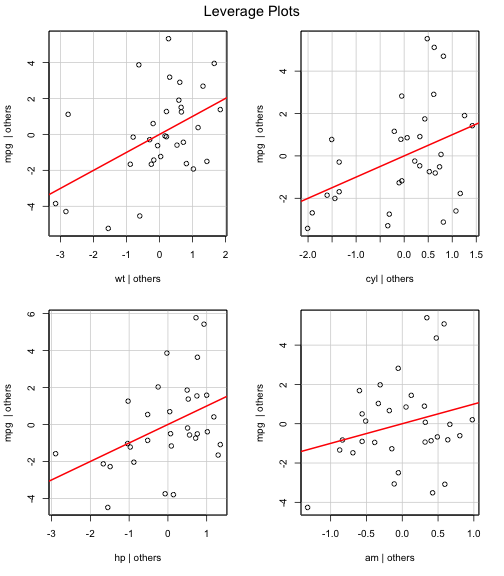

**Executive Summary**

Looking at a data set of a collection of cars, Motor Trend (a magazine about the automobile industry) are interested in exploring the relationship between a set of variables and miles per gallon (MPG). They are particularly interested in the following two questions: 

1. Is an automatic or manual transmission better for MPG? 
2. How different is the MPG between automatic and manual transmissions? 

**Exploratory Data Analysis**

We load the *mtcars* dataset, and coerce the categorical variables as factor. Next, we create a boxplot of MPG for cars with automatic and manual transmission.


 

*We find that MPG of manual transmission cars is higher.* We do inferential data analysis to quantify if this difference in MPG is significant.

**Inferential Data Analyis**

We do a t-test on MPG as outcome and transmission as grouping variable. 


```
## 
## 	Welch Two Sample t-test
## 
## data:  mpg by am
## t = -3.767, df = 18.33, p-value = 0.001374
## alternative hypothesis: true difference in means is not equal to 0
## 95 percent confidence interval:
##  -11.28  -3.21
## sample estimates:
## mean in group Automatic    mean in group Manual 
##                   17.15                   24.39
```

*The t-test results indicate that mean MPG of manual transmissions cars is 24.39 whereas that of automatic transmission cars is 17.15. This difference is significant (p-value is 0.001374)*. We follow up this analysis by regression analyses to identify the factors influencing MPG.


**Regression Analyes**

We perform regression analyses with both forward, backward and stepwise selection of predictor variables as shown below so as to obtain the most parsimonious model. All the three approaches result in the same final model. The detailed R output of model creation is not provided due to space constraint.


```r
full.model <- lm(mpg ~ ., data=mtcars)
backward.model <- step(full.model, data=mtcars, direction="backward")

null.model <- lm(mpg ~ 1, data=mtcars)
forward.model <- step(null.model, data=mtcars, direction="forward",
                      scope=list(lower=null.model, upper=full.model))

stepwise.model <- step(null.model, data=Housing, direction="both",
                       scope = list(upper=full.model))
```

```r
summary(forward.model)
```

```
## 
## Call:
## lm(formula = mpg ~ wt + cyl + hp + am, data = mtcars)
## 
## Residuals:
##    Min     1Q Median     3Q    Max 
## -3.939 -1.256 -0.401  1.125  5.051 
## 
## Coefficients:
##             Estimate Std. Error t value Pr(>|t|)    
## (Intercept)  33.7083     2.6049   12.94  7.7e-13 ***
## wt           -2.4968     0.8856   -2.82   0.0091 ** 
## cyl6         -3.0313     1.4073   -2.15   0.0407 *  
## cyl8         -2.1637     2.2843   -0.95   0.3523    
## hp           -0.0321     0.0137   -2.35   0.0269 *  
## amManual      1.8092     1.3963    1.30   0.2065    
## ---
## Signif. codes:  0 '***' 0.001 '**' 0.01 '*' 0.05 '.' 0.1 ' ' 1
## 
## Residual standard error: 2.41 on 26 degrees of freedom
## Multiple R-squared:  0.866,	Adjusted R-squared:  0.84 
## F-statistic: 33.6 on 5 and 26 DF,  p-value: 1.51e-10
```

The above procedure determines that *the best model includes the cyl6, cyl8, hp, wt, and amManual variables* (overall p-value<0.001). The adjusted R-squared indicates that about 84% of the variance is explained by the final model. 

This model suggests that MPG decreases with respect to cylinders (-3.03 and -2.16 for cyl4 vs. cyl6 and cyl4 vs. cyl8, respectively), horsepower (-0.03), and weight (for every 1000 lb by -2.5). On the other hand, MPG increases with respect to having a manual transmission (1.8). Note that number of cylinders (cyl) is a categorical variable with three levels. Therefore, two dummy variables cyl6 and cyl8 are created during regression. The coefficient of cyl6 indicates the increase in MPG when number of cylinders goes from 4 to 6. Similarly, the coefficient of cyl6 indicates the increase in MPG when number of cylinders goes from 4 to 6.

\newpage

**Appendix**


```r
ggplot(aes(x=cyl, y=mpg, fill=am), data=mtcars) + geom_boxplot()
```

 

```r
ggplot(aes(x=wt, y=mpg, colour=am), data=mtcars) + geom_point()
```

 

```r
ggplot(aes(x=hp, y=mpg, colour=am), data=mtcars) + geom_point()
```

 

```r
# Residual and Diagnostic plots
layout(matrix(c(1,2,3,4),2,2))
plot(forward.model)
```

 

```r
library(car)

# leverage plots
leveragePlots(forward.model)
```

 

```r
# Cook's D plot
cutoff <- 4/((nrow(mtcars)-length(forward.model$coefficients)-2))
plot(forward.model, which=4, cook.levels=cutoff)
```

 

```r
# Influence Plot
influencePlot(forward.model, id.method="identify", main="Influence Plot", 
              sub="Circle size is proportional to Cook's Distance" )
```

 
